# seekwhale-on-dsh

English | [中文](README.md)

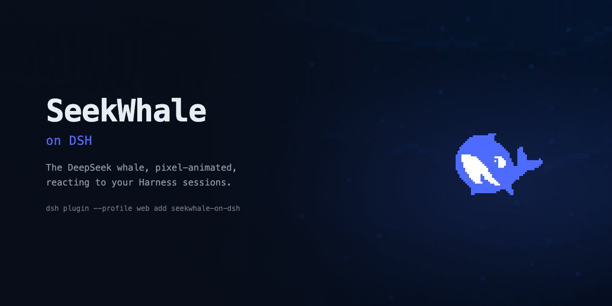

A DeepSeek Harness plugin: the DeepSeek whale, pixel-animated, floating in the
corner of `dsh web` and reacting to your sessions.

The whale is the DeepSeek logo pixelated onto a **40×31 grid** and animated
frame-by-frame. Every state is a **single SVG carrying its own CSS keyframes** — no
GIF, no APNG, no script — so it stays sharp at any size and survives any sanitizer.

<p align="center">
  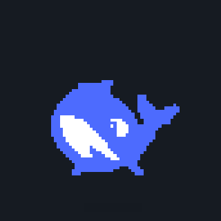
</p>

## Install

```sh
dsh plugin --profile web add seekwhale-on-dsh
dsh web
```

That is the whole install — the whale is bottom-right. Nothing to hand-edit: the
package ships its own bundle patch (`dsh.bundle.patch`), so `dsh plugin add` records
it in the profile's `dsh.profile.bundles` and its patch layer inserts the plugin
itself. Do **not** also add it to your profile's `cordis.patch.yml`; that would
insert the same entry twice.

> If `dsh web` was already running when you installed, restart it. The host keeps
> its plugin table in memory, and a stale entry can serve the bundle a second time
> under an old path, which trips `duplicate factory registration`.

## What it does

It sits in the `shell.overlay` slot — the frame-wide floating layer DSH keeps for
exactly this, additive and click-through — and reads the session snapshot.

| your sessions | the whale |
| --- | --- |
| waiting on a permission prompt (`pendingInteraction: approval`) | startles, wide-eyed |
| waiting on a question (`question`) | tilts back and ponders |
| waiting on a plan review (`plan-review`) | squints at a chart |
| two or more turns running | hunches over a terminal |
| one turn running | types, thought-bubbles rising |
| finished and you have not looked (`completed`) | breaches and celebrates |
| all quiet | floats — and now and then reads, drinks coffee, yawns or spouts |
| quiet for 90s | sleeps, Zzz drifting up |
| you are dragging it | carries |

One whale for the whole window, not one per session, and urgency wins: being asked
outranks work in flight, which outranks a finished turn nobody has looked at.

Every one of them, looping:

| approval | question | review | working | swarm |
|:--:|:--:|:--:|:--:|:--:|
| 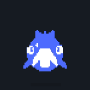 | 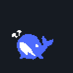 | 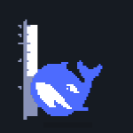 | 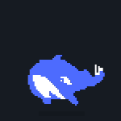 | 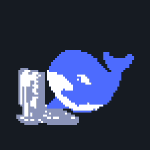 |

| done | idle | read | coffee | yawn |
|:--:|:--:|:--:|:--:|:--:|
|  |  | 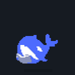 | 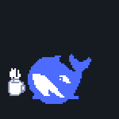 | 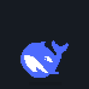 |

| spout | sleeping | carrying | poke | annoyed |
|:--:|:--:|:--:|:--:|:--:|
|  | 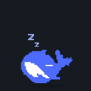 | 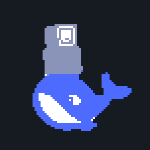 |  |  |

Two things are not in the snapshot and come from a clock instead. **Sleep**, because
"nothing has happened" is not an event. And the **idle flourishes** — a whale that
only ever hangs there through the two thirds of the day you are not running anything
is the dullest possible pet, so every 12-30s it plays one pose for exactly one of its
own cycles and hands back. One cycle exactly: the loop seam then lands on the swap
and is never seen.

The nine `mini-*` poses are the only art left out — they are a desktop-window idea
with no web equivalent.

## Handling it

- **Poke it.** One click and it startles; keep clicking inside ~1.8s and it gets
  annoyed. That second tier is the only way `error` art can ever appear — nothing in
  the session snapshot says "this failed".
- **Drag it** anywhere; it plays its carrying pose while held and remembers where you
  dropped it (`localStorage`, key `seekwhale:spot`). A drag is not a poke: the click
  only counts if the pointer stayed within 4px and let go inside 500ms.
- **Alt-click** steps through every state and back to live, so you can look at the
  art without waiting for a real permission prompt. The pinned state is labelled
  above the whale.

Only the whale is grabbable, not its box: the grab handle is the theme's own
`hitBoxes.default` rectangle, about a quarter of the box area. The rest stays
click-through, because a boxful of transparent pixels has no business eating clicks
meant for the app underneath.

## Build

```sh
node build.mjs        # src/client.js + assets/ → lib/client.js
```

No compiler, and that is on purpose. DSH serves a plugin's browser half as **one
file** that calls `window.__ModuleLoader__.load({ id, factory })` and pulls shared
deps from the loader's `require` shim — not as an ES module. Nothing about that
needs a bundler, so `build.mjs` concatenates: it inlines the art, wraps
`src/client.js` in the envelope, and writes `lib/client.js`.

The art is inlined rather than fetched because **only `lib/client.js` is
addressable** — the host serves that path, not the package directory, so a sibling
`assets/` would 404 in the browser. It goes in **gzipped**: these SVGs are one long
run of near-identical path and keyframe text and deflate about 8.7x, which is what
makes fifteen states fit in 310 KB instead of 2 MB. The browser inflates each one
on first use with `DecompressionStream` and hands it to an `` as a blob URL —
its own document, so their CSS never meets.

`lib/client.js` is committed: consumers install this package and DSH reads the file
straight off disk.

## Layout

```
src/client.js   the plugin — plain readable JS, no build magic
build.mjs       inlines assets and wraps src into DSH's bundle envelope
assets/         the 14 SVGs it uses (several states share one file)
lib/index.js    host half: an empty apply(), so the entry appears in the tree —
                which is what makes DSH read dsh.client and serve the browser half
lib/client.js   built artifact
```

The art is generated from video in a separate authoring workspace; this repo carries
only the finished SVGs.

## License

MIT — see [LICENSE](LICENSE). The whale is derived from the DeepSeek logo.
